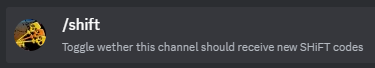

# reSHiFT

This is a revival of the original **SHiFT** discord bot.

## Invite link:
https://discord.com/api/oauth2/authorize?client_id=1130849329519804578&permissions=2048&scope=bot%20applications.commands





## Script to save page on load
```js
console.log("waiting to populate html")
setTimeout(saveHtml, 5000)

function saveHtml(filename) {
    console.log("saving html")
    const myHtml = document.querySelector("html").innerHTML;
    if (!filename) filename = 'html.html'

    var blob = new Blob([myHtml], {
        type: 'text/html'
    }),
        e = document.createEvent('MouseEvents'),
        a = document.createElement('a')

    a.download = filename
    a.href = window.URL.createObjectURL(blob)
    a.dataset.downloadurl = ['text/html', a.download, a.href].join(':')
    e.initMouseEvent('click', true, false, window, 0, 0, 0, 0, 0, false, false, false, false, 0, null)
    a.dispatchEvent(e)
}

```

## Build any version of Node
```
cd /usr/local/src
wget http://nodejs.org/dist/latest/node-v7.2.1.tar.gz
tar -xvzf node-v7.2.1.tar.gz
cd node-v7.2.1
./configure
make
sudo make install
which node
```
